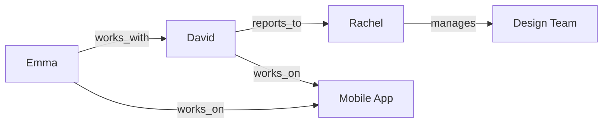

# API DOC
## Add memory
```bash
curl --request POST \
--url https://api.mem0.ai/v1/memories/ \
--header 'Authorization: Token YOUR_API_KEY' \
--header 'Content-Type: application/json' \
--data '{
"messages": [
  {
    "role": "user",
    "content": "Hi, I'm Alex. I'm a vegetarian and I'm allergic to nuts."
  },
  {
    "role": "assistant", 
    "content": "Hello Alex! I see that you're a vegetarian with a nut allergy."
  }
],
"user_id": "alex",
"version": "v2"
}'
```

## Search memory
Send a POST request to search through user's memory
```bash
curl --request POST \
--url https://api.mem0.ai/v2/memories/search/ \
--header 'Authorization: Token YOUR_API_KEY' \
--header 'Content-Type: application/json' \
--data '{
"query": "What can I cook for dinner tonight?",
"filters": {
  "OR": [
    { "user_id": "alex" }
  ]
}
}'
```

---

> ## Documentation Index
> Fetch the complete documentation index at: https://docs.mem0.ai/llms.txt
> Use this file to discover all available pages before exploring further.

# Build a Companion with Mem0

> Spin up a fitness coach that remembers goals, adapts tone, and keeps sessions personal.

Essentially, creating a companion out of LLMs is as simple as a loop. But these loops work great for one type of character without personalization and fall short as soon as you restart the chat.

Problem: LLMs are stateless. GPT doesn't remember conversations. You could stuff everything inside the context window, but that becomes slow, expensive, and breaks at scale.

The solution: Mem0. It extracts and stores what matters from conversations, then retrieves it when needed. Your companion remembers user preferences, past events, and history.

In this cookbook we'll build a **fitness companion** that:

* Remembers user goals across sessions
* Recalls past workouts and progress
* Adapts its personality based on user preferences
* Handles both short-term context (today's chat) and long-term memory (months of history)

By the end, you'll have a working fitness companion and know how to handle common production challenges.

***

## The Basic Loop with Memory

Max wants to train for a marathon. He starts chatting with Ray, an AI running coach.

```python  theme={null}
from openai import OpenAI
from mem0 import MemoryClient

openai_client = OpenAI(api_key="your-openai-key")
mem0_client = MemoryClient(api_key="your-mem0-key")

def chat(user_input, user_id):
    # Retrieve relevant memories
    memories = mem0_client.search(user_input, user_id=user_id, limit=5)
    context = "\\n".join(m["memory"] for m in memories["results"])

    # Call LLM with memory context
    response = openai_client.chat.completions.create(
        model="gpt-4o-mini",
        messages=[
            {"role": "system", "content": f"You're Ray, a running coach. Memories:\\n{context}"},
            {"role": "user", "content": user_input}
        ]
    ).choices[0].message.content

    # Store the exchange
    mem0_client.add([
        {"role": "user", "content": user_input},
        {"role": "assistant", "content": response}
    ], user_id=user_id)

    return response

```

**Session 1:**

```python  theme={null}
chat("I want to run a marathon in under 4 hours", user_id="max")
# Output: "That's a solid goal. What's your current weekly mileage?"
# Stored in Mem0: "Max wants to run sub-4 marathon"

```

**Session 2 (next day, app restarted):**

```python  theme={null}
chat("What should I focus on today?", user_id="max")
# Output: "Based on your sub-4 marathon goal, let's work on building your aerobic base..."

```

<Info>
  Ray remembers Max's goal across sessions. The app restarted, but the memory persisted. This is the core pattern: retrieve memories, pass them as context, store new exchanges.
</Info>

Ray remembers. Restart the app, and the goal persists. From here on, we'll focus on just the Mem0 API calls.

***

## Organizing Memory by Type

### Separating Temporary from Permanent

Max mentions his knee hurts. That's different from his marathon goal - one is temporary, the other is long-term.

**Categories vs Metadata:**

* **Categories**: AI-assigned by Mem0 based on content (you can't force them)
* **Metadata**: Manually set by you for forced tagging

Define custom categories at the project level. Mem0 will automatically tag memories with relevant categories based on content:

```python  theme={null}
mem0_client.project.update(custom_categories=[
    {"goals": "Race targets and training objectives"},
    {"constraints": "Injuries, limitations, recovery needs"},
    {"preferences": "Training style, surfaces, schedules"}
])

```

<Note>
  **Categories vs Metadata:** Categories are AI-assigned by Mem0 based on content semantics. You define the palette, Mem0 picks which ones apply. If you need guaranteed tagging, use `metadata` instead.
</Note>

Now when you add memories, Mem0 automatically assigns the appropriate categories:

```python  theme={null}
# Add goal - Mem0 automatically tags it as "goals"
mem0_client.add(
    [{"role": "user", "content": "Sub-4 marathon is my A-race"}],
    user_id="max"
)

# Add constraint - Mem0 automatically tags it as "constraints"
mem0_client.add(
    [{"role": "user", "content": "My right knee flares up on downhills"}],
    user_id="max"
)

```

Mem0 reads the content and intelligently picks which categories apply. You define the palette, it handles the tagging.

**Important:** You cannot force specific categories. Mem0's platform decides which categories are relevant based on content. If you need to force-tag something, use `metadata` instead:

```python  theme={null}
# Force tag using metadata (not categories)
mem0_client.add(
    [{"role": "user", "content": "Some workout note"}],
    user_id="max",
    metadata={"workout_type": "speed", "forced_tag": "custom_label"}
)

```

### Filtering by Category

Retrieve just constraints for workout planning:

```python  theme={null}
constraints = mem0_client.search(
    query="injury concerns",
    filters={
        "AND": [
            {"user_id": "max"},
            {"categories": {"in": ["constraints"]}}
        ]
    },
    threshold=0.0  # optional: widen recall for short phrases
)
print([m["memory"] for m in constraints["results"]])
# Output: ["Max's right knee flares up on downhills"]

```

Ray can plan workouts that avoid aggravating Max's knee, without pulling in race goals or other unrelated memories.

***

## Filtering What Gets Stored

### The Problem

Run the basic loop for a week and check what's stored:

```python  theme={null}
memories = mem0_client.get_all(filters={"AND": [{"user_id": "max"}]})
print([m["memory"] for m in memories["results"]])
# Output: ["Max wants to run marathon under 4 hours", "hey", "lol ok", "cool thanks", "gtg bye"]

```

<Warning>
  Without filters, Mem0 stores everything—greetings, filler, and casual chat. This pollutes retrieval: instead of pulling "marathon goal," you get "lol ok." Set custom instructions to keep memory clean.
</Warning>

Noise. Greetings and filler clutter the memory.

### Custom Instructions

Tell Mem0 what matters:

```python  theme={null}
mem0_client.project.update(custom_instructions="""
Extract from running coach conversations:
- Training goals and race targets
- Physical constraints or injuries
- Training preferences (time of day, surfaces, weather)
- Progress milestones

Exclude:
- Greetings and filler
- Casual chatter
- Hypotheticals unless planning related
""")

```

Now chat again:

```python  theme={null}
chat("hey how's it going", user_id="max")
chat("I prefer trail running over roads", user_id="max")

memories = mem0_client.get_all(filters={"AND": [{"user_id": "max"}]})
print([m["memory"] for m in memories["results"]])
# Output: ["Max wants to run marathon under 4 hours", "Max prefers trail running over roads"]

```

<Info>
  **Expected output:** Only 2 memories stored—the marathon goal and trail preference. The greeting "hey how's it going" was filtered out automatically. Custom instructions are working.
</Info>

Only meaningful facts. Filler gets dropped automatically.

***

***

## Agent Memory for Personality

### Why Agents Need Memory Too

Max prefers direct feedback, not motivational fluff. Ray needs to remember how to communicate - that's agent memory, separate from user memory.

Store agent personality:

```python  theme={null}
mem0_client.add(
    [{"role": "system", "content": "Max wants direct, data-driven feedback. Skip motivational language."}],
    agent_id="ray_coach"
)

```

Retrieve agent style alongside user memories:

```python  theme={null}
# Get coach personality
agent_memories = mem0_client.search("coaching style", agent_id="ray_coach")
# Output: ["Max wants direct, data-driven feedback. Skip motivational language."]

# Store conversations with agent_id
mem0_client.add([
    {"role": "user", "content": "How'd my run look today?"},
    {"role": "assistant", "content": "Pace was 8:15/mile. Heart rate 152, zone 2."}
], user_id="max", agent_id="ray_coach")

```

<Info>
  **Expected behavior:** Ray's responses are now data-driven and direct. The agent memory stored the coaching style preference, so future responses adapt automatically without Max having to repeat his preference.
</Info>

No "Great job!" or "Keep it up!" - just data. Ray adapts to Max's preference.

***

## Managing Short-Term Context

### When to Store in Mem0

Don't send every single message to Mem0. Keep recent context in memory, let Mem0 handle the important long-term facts.

```python  theme={null}
# Store only meaningful exchanges in Mem0
mem0_client.add([
    {"role": "user", "content": "I want to run a marathon"},
    {"role": "assistant", "content": "Let's build a training plan"}
], user_id="max")

# Skip storing filler
# "hey" → don't store
# "cool thanks" → don't store

# Or rely on custom_instructions to filter automatically

```

Last 10 messages in your app's buffer. Important facts in Mem0. Faster, cheaper, still works.

***

## Time-Bound Memories

### Auto-Expiring Facts

Max tweaks his ankle. It'll heal in two weeks - the memory should expire too.

```python  theme={null}
from datetime import datetime, timedelta

expiration = (datetime.now() + timedelta(days=14)).strftime("%Y-%m-%d")

mem0_client.add(
    [{"role": "user", "content": "Rolled my left ankle, needs rest"}],
    user_id="max",
    expiration_date=expiration
)

```

In 14 days, this memory disappears automatically. Ray stops asking about the ankle.

***

## Putting It All Together

Here's the Mem0 setup combining everything:

```python  theme={null}
from mem0 import MemoryClient
from datetime import datetime, timedelta

mem0_client = MemoryClient(api_key="your-mem0-key")

# Configure memory filtering and categories
mem0_client.project.update(
    custom_instructions="""
    Extract: goals, constraints, preferences, progress
    Exclude: greetings, filler, casual chat
    """,
    custom_categories=[
        {"name": "goals", "description": "Training targets"},
        {"name": "constraints", "description": "Injuries and limitations"},
        {"name": "preferences", "description": "Training style"}
    ]
)

```

**Week 1 - Store goals and preferences:**

```python  theme={null}
mem0_client.add([
    {"role": "user", "content": "I want to run a sub-4 marathon"},
    {"role": "assistant", "content": "Got it. Let's build a training plan."}
], user_id="max", agent_id="ray", categories=["goals"])

mem0_client.add([
    {"role": "user", "content": "I prefer trail running over roads"}
], user_id="max", categories=["preferences"])

```

**Week 3 - Temporary injury with expiration:**

```python  theme={null}
expiration = (datetime.now() + timedelta(days=14)).strftime("%Y-%m-%d")
mem0_client.add(
    [{"role": "user", "content": "Rolled ankle, need light workouts"}],
    user_id="max",
    categories=["constraints"],
    expiration_date=expiration
)

```

**Retrieve for context:**

```python  theme={null}
memories = mem0_client.search("training plan", user_id="max", limit=5)
# Gets: marathon goal, trail preference, ankle injury (if still valid)

```

Ray remembers goals, preferences, and personality. Handles temporary injuries. Works across sessions.

***

## Common Production Patterns

### Episodic Stories with run\_id

Training for Boston is different from training for New York. Separate the memory threads:

```python  theme={null}
mem0_client.add(messages, user_id="max", run_id="boston-2025")
mem0_client.add(messages, user_id="max", run_id="nyc-2025")

# Retrieve only Boston memories
boston_memories = mem0_client.search(
    "training plan",
    user_id="max",
    run_id="boston-2025"
)

```

Each race gets its own episodic boundary. No cross-contamination.

### Importing Historical Data

Max has 6 months of training logs to backfill:

```python  theme={null}
old_logs = [
    [{"role": "user", "content": "Completed 20-mile long run"}],
    [{"role": "user", "content": "Hit 8:00 pace on tempo run"}],
]

for log in old_logs:
    mem0_client.add(log, user_id="max")

```

### Handling Contradictions

Max changes his goal from sub-4 to sub-3:45:

```python  theme={null}
# Find the old memory
memories = mem0_client.get_all(filters={"AND": [{"user_id": "max"}]})
goal_memory = [m for m in memories["results"] if "sub-4" in m["memory"]][0]

# Update it
mem0_client.update(goal_memory["id"], "Max wants to run sub-3:45 marathon")

```

Update instead of creating duplicates.

### Multiple Agents

Max works with Ray for running and Jordan for strength training:

```python  theme={null}
chat("easy run today", user_id="max", agent_id="ray")
chat("leg day workout", user_id="max", agent_id="jordan")

```

Each coach maintains separate personality memory while sharing user context.

### Filtering by Date

Prioritize recent training over old data:

```python  theme={null}
recent = mem0_client.search(
    "training progress",
    user_id="max",
    filters={"created_at": {"gte": "2025-10-01"}}
)

```

### Metadata Tagging

Tag workouts by type:

```python  theme={null}
mem0_client.add(
    [{"role": "user", "content": "10x400m intervals"}],
    user_id="max",
    metadata={"workout_type": "speed", "intensity": "high"}
)

# Later, find all speed workouts
speed_sessions = mem0_client.search(
    "speed work",
    user_id="max",
    filters={"metadata": {"workout_type": "speed"}}
)

```

### Pruning Old Memories

Delete irrelevant memories:

```python  theme={null}
mem0_client.delete(memory_id="mem_xyz")

# Or clear an entire run_id
mem0_client.delete_all(user_id="max", run_id="old-training-cycle")

```

***

## What You Built

A companion that:

* **Persists across sessions** - Mem0 storage
* **Filters noise** - custom instructions
* **Organizes by type** - categories
* **Adapts personality** - **`agent_id`**
* **Stays fast** - short-term buffer
* **Handles temporal facts** - expiration
* **Scales to production** - batching, metadata, pruning

This pattern works for any companion: fitness coaches, tutors, roleplay characters, therapy bots, creative writing partners.

***

<Tip>
  Start with 2-3 categories max (e.g., goals, constraints, preferences). More categories dilute tagging accuracy. You can always add more later after seeing what Mem0 extracts.
</Tip>

***

## Production Checklist

Before launching:

* Set custom instructions for your domain
* Define 2-3 categories (goals, constraints, preferences)
* Add expiration strategy for time-bound facts
* Implement error handling for API calls
* Monitor memory quality in Mem0 dashboard
* Clear test data from production project

***

<CardGroup cols={2}>
  <Card title="Partition Memories by Entity" icon="layers" href="/cookbooks/essentials/entity-partitioning-playbook">
    Keep companions from leaking context by combining user, agent, and session scopes.
  </Card>

  <Card title="Tag Support Memories" icon="tag" href="/cookbooks/essentials/tagging-and-organizing-memories">
    Organize customer context to keep assistants responsive at scale.
  </Card>
</CardGroup>


Built with [Mintlify](https://mintlify.com).

---

## > ## Documentation Index
> Fetch the complete documentation index at: https://docs.mem0.ai/llms.txt
> Use this file to discover all available pages before exploring further.

# Partition Memories by Entity

> Keep memories separate by tagging each write and query with user, agent, app, and session identifiers.

Nora runs a travel service. When she stored all memories in one bucket, a recruiter's nut allergy accidentally appeared in a traveler's dinner reservation. Let's fix this by properly separating memories for different users, agents, and applications.

<Info icon="clock">
  **Time to complete:** \~15 minutes · **Languages:** Python
</Info>

## Setup

```python  theme={null}
from mem0 import MemoryClient

client = MemoryClient(api_key="m0-...")
```

Grab an API key from the <Link href="https://app.mem0.ai/">Mem0 dashboard</Link> to get started.

## Store and Retrieve Scoped Memories

Let's start by storing Cam's travel preferences and retrieving them:

```python  theme={null}
cam_messages = [
    {"role": "user", "content": "I'm Cam. Keep in mind I avoid shellfish and prefer boutique hotels."},
    {"role": "assistant", "content": "Noted! I'll use those preferences in future itineraries."}
]

result = client.add(
    cam_messages,
    user_id="traveler_cam",
    agent_id="travel_planner",
    run_id="tokyo-2025-weekend",
    app_id="concierge_app"
)
```

The memory is now stored. Let's retrieve those memories with the same identifiers:

```python  theme={null}
user_scope = {
    "AND": [
        {"user_id": "traveler_cam"},
        {"app_id": "concierge_app"},
        {"run_id": "tokyo-2025-weekend"}
    ]
}
user_memories = client.search("Any dietary restrictions?", filters=user_scope)
print(user_memories)

agent_scope = {
    "AND": [
        {"agent_id": "travel_planner"},
        {"app_id": "concierge_app"}
    ]
}
agent_memories = client.search("Any dietary restrictions?", filters=agent_scope)
print(agent_memories)
```

**Output:**

```
# User scope returns user's memory
{'results': [{'memory': 'avoids shellfish and prefers boutique hotels', ...}]}
# Agent scope returns agent's own memory
{'results': [{'memory': 'Cam prefers boutique hotels and avoids shellfish', ...}]}
```

<Tip icon="compass">
  Memories can be written with several identifiers, but each search resolves one entity boundary at a time. Run separate queries for user and agent scopes—just like above—rather than combining both in a single filter.
</Tip>

## When Memories Leak

When Nora adds a chef agent, Cam's travel preferences leak into food recommendations:

```python  theme={null}
chef_filters = {"AND": [{"user_id": "traveler_cam"}]}

collision = client.search("What should I cook?", filters=chef_filters)
print(collision)
```

**Output:**

```
['avoids shellfish and prefers boutique hotels', 'prefers Kyoto kaiseki dining experiences']
```

The travel preferences appear because we only filtered by `user_id`. The chef agent shouldn't see hotel preferences.

## Fix the Leak with Proper Filters

First, let's add a memory specifically for the chef agent:

```python  theme={null}
chef_memory = [
    {"role": "user", "content": "I'd like to try some authentic Kyoto cuisine."},
    {"role": "assistant", "content": "I'll remember that you prefer Kyoto kaiseki dining experiences."}
]

client.add(
    chef_memory,
    user_id="traveler_cam",
    agent_id="chef_recommender",
    run_id="menu-planning-2025-04",
    app_id="concierge_app"
)
```

Now search within the chef's scope:

```python  theme={null}
safe_filters = {
    "AND": [
        {"agent_id": "chef_recommender"},
        {"app_id": "concierge_app"},
        {"run_id": "menu-planning-2025-04"}
    ]
}

chef_memories = client.search("Any food alerts?", filters=safe_filters)
print(chef_memories)
```

**Output:**

```
{'results': [{'memory': 'prefers Kyoto kaiseki dining experiences', ...}]}
```

Now the chef agent only sees its own food preferences. The hotel preferences stay with the travel agent.

## Separate Apps with app\_id

Nora white-labels her travel service for a sports brand. Use `app_id` to keep enterprise data separate:

```python  theme={null}
enterprise_filters = {
    "AND": [
        {"app_id": "sports_brand_portal"}
    ],
    "OR": [
        {"user_id": "*"},
        {"agent_id": "*"}
    ]
}

page = client.get_all(filters=enterprise_filters, page=1, page_size=10)
print([row["user_id"] for row in page["results"]])
```

**Output:**

```
['athlete_jane', 'coach_mike', 'team_admin']
```

<Info>
  Wildcards (`"*"` ) only match non-null values. Make sure you write memories with explicit `app_id` values.
</Info>

<Tip icon="sparkles">
  Need a deeper tour of AND vs OR, nested filters, or wildcard tricks? Check the <Link href="/platform/features/v2-memory-filters">Memory Filters v2 guide</Link> for full examples you can copy into this flow.
</Tip>

When the sports brand offboards, delete all their data:

```python  theme={null}
client.delete_all(app_id="sports_brand_portal")
```

**Output:**

```
{'message': 'Memories deleted successfully!'}
```

## Production Patterns

```python  theme={null}
# Nightly audits - check all data for an app
def audit_app(app_id: str):
    filters = {
        "AND": [{"app_id": app_id}],
        "OR": [{"user_id": "*"}, {"agent_id": "*"}]
    }
    return client.get_all(filters=filters, page=1, page_size=50)

# Session cleanup - delete temporary conversations
def close_ticket(ticket_id: str, user_id: str):
    client.delete_all(user_id=user_id, run_id=ticket_id)

# Compliance exports - get all data for one tenant
export = client.get_memory_export(filters={"AND": [{"app_id": "sports_brand_portal"}]})
```

## Complete Example

Putting it all together - here's how to properly scope memories:

```python  theme={null}
# Store memories with all identifiers
client.add(
    [{"role": "user", "content": "I need a hotel near the conference center."}],
    user_id="exec_123",
    agent_id="booking_assistant",
    app_id="enterprise_portal",
    run_id="trip-2025-03"
)

# Retrieve with the same scope
filters = {
    "AND": [
        {"user_id": "exec_123"},
        {"app_id": "enterprise_portal"},
        {"run_id": "trip-2025-03"}
    ]
}

# Alternative: Use wildcards if you're not sure about some fields
# filters = {
#     "AND": [
#         {"user_id": "exec_123"},
#         {"agent_id": "*"},  # Match any agent
#         {"app_id": "enterprise_portal"},
#         {"run_id": "*"}      # Match any run
#     ]
# }

results = client.search("Hotels near conference", filters=filters)

# Debug: Print the filter you're using
print(f"Searching with filters: {filters}")

# If no results, try a broader search to see what's stored
if not results["results"]:
    print("No results found! Trying broader search...")
    broader = client.get_all(filters={"user_id": "exec_123"})
    print(broader)

print(results["results"][0]["memory"])
```

**Output:**

```
I need a hotel near the conference center.
```

## When to Use Each Identifier

| Identifier | When to Use                                                 | Example Values                                                |
| ---------- | ----------------------------------------------------------- | ------------------------------------------------------------- |
| `user_id`  | Individual preferences that persist across all interactions | `cam_traveler`, `sarah_exec`, `team_alpha`                    |
| `agent_id` | Different AI roles need separate context                    | `travel_agent`, `concierge`, `customer_support`               |
| `app_id`   | White-label deployments or separate products                | `travel_app_ios`, `enterprise_portal`, `partner_integration`  |
| `run_id`   | Temporary sessions that should be isolated                  | `support_ticket_9234`, `chat_session_456`, `booking_flow_789` |

## Troubleshooting Common Issues

### My search returns empty results!

**Problem**: Using `AND` with exact matches but some fields might be `null`.

**Solution**:

```python  theme={null}
# If this returns nothing:
filters = {"AND": [{"user_id": "u1"}, {"agent_id": "a1"}]}

# Try using wildcards:
filters = {"AND": [{"user_id": "u1"}, {"agent_id": "*"}]}

# Or don't include fields you don't need:
filters = {"AND": [{"user_id": "u1"}]}
```

### OR gives results but AND doesn't

This confirms you have a **field mismatch**. The memory exists but some identifier values don't match exactly.

**Always check what's actually stored:**

```python  theme={null}
# Get all memories for the user to see the actual field values
all_mems = client.get_all(filters={"user_id": "your_user_id"})
print(json.dumps(all_mems, indent=2))
```

## Best Practices

1. **Use consistent identifier formats**
   ```python  theme={null}
   # Good: consistent patterns
   user_id = "cam_traveler"
   agent_id = "travel_agent_v1"
   app_id = "nora_concierge_app"
   run_id = "tokyo_trip_2025_03"

   # Avoid: mixed patterns
   # user_id = "123", agent_id = "agent2", app_id = "app"
   ```

2. **Print filters when debugging**
   ```python  theme={null}
   filters = {"AND": [{"user_id": "cam", "agent_id": "chef"}]}
   print(f"Searching with filters: {filters}")  # Helps catch typos
   ```

3. **Clean up temporary sessions**
   ```python  theme={null}
   # After a support ticket closes
   client.delete_all(user_id="customer_123", run_id="ticket_456")
   ```

## Summary

You learned how to:

* Store memories with proper entity scoping using `user_id`, `agent_id`, `app_id`, and `run_id`
* Prevent memory leaks between different agents and applications
* Clean up data for specific tenants or sessions
* Use wildcards to query across scoped memories

## Next Steps

<CardGroup cols={2}>
  <Card title="Deep Dive: Memory Filters v2" description="Layer entity filters with JSON logic to answer complex queries." icon="sliders" href="/platform/features/v2-memory-filters" />

  <Card title="Control Memory Ingestion" description="Pair scoped storage with rules that block low-quality facts." icon="shield-check" href="/cookbooks/essentials/controlling-memory-ingestion" />
</CardGroup>


Built with [Mintlify](https://mintlify.com).

---

> ## Documentation Index
> Fetch the complete documentation index at: https://docs.mem0.ai/llms.txt
> Use this file to discover all available pages before exploring further.

# Choose Vector vs Graph Memory

> Blend vector search with graph relationships to answer multi-hop questions.

Most AI agents use vector stores for RAG operations - they work great for semantic search and retrieving relevant context. But there's a gap when queries require understanding connections between entities.

Mem0 brings graph memory into the picture to fill this gap. In this cookbook, we'll create a company knowledge base with Mem0, using both vector and graph stores. You'll learn when each one helps along the way.

***

## Vector and Graph Stores

When you add a memory to Mem0, it goes into a **vector store** by default. Vector stores are excellent at semantic search - finding memories that match the meaning of your query.

**Graph stores** work differently. They extract **entities** (people, projects, teams) and **relationships between them** (works\_with, reports\_to, member\_of). This lets you answer questions that need connecting information across multiple memories.

We will go through examples in this cookbook while building a company's knowledge base along the way.

***

## Starting Simple

Since we're building a company knowledge base, let's add some employee information:

```python  theme={null}
from mem0 import MemoryClient

client = MemoryClient(api_key="your-api-key")
# Add employee info
client.add("Emma is a software engineer in Seattle", user_id="company_kb")
client.add("David is a product manager in Austin", user_id="company_kb")

```

Now let's search for Emma's role:

```python  theme={null}
results = client.search("What does Emma do?", filters={"user_id": "company_kb"})
print(results['results'][0]['memory'])

```

**Output:**

```
Emma is a software engineer in Seattle

```

<Info>
  **Expected output:** Vector search returned Emma's role instantly. When queries ask for facts directly stored in one memory, vector semantic search is perfect—fast and accurate.
</Info>

This works perfectly. Vector search found the memory that semantically matches "What does Emma do?" and returned Emma's role.

***

## Adding Team Structure

Let's add some information about how the team works together:

```python  theme={null}
client.add("Emma works with David on the mobile app redesign", user_id="company_kb")
client.add("David reports to Rachel, who manages the design team", user_id="company_kb")

```

Now we have two pieces of information stored:

1. Emma works with David
2. David reports to Rachel

Let's try asking something that needs both pieces:

```python  theme={null}
results = client.search(
    "Who is Emma's teammate's manager?",
    filters={"user_id": "company_kb"}
)

for r in results['results']:
    print(r['memory'])

```

**Output:**

```
Emma works with David on the mobile app redesign
David reports to Rachel, who manages the design team

```

Vector search returned both memories, but it didn't connect them. You'd need to manually figure out:

* Emma's teammate is David (from memory 1)
* David's manager is Rachel (from memory 2)
* So the answer is Rachel

<Warning>
  Vector search can't traverse relationships. It returns relevant memories, but you must connect the dots manually. For "Who is Emma's teammate's manager?", vector search gives you the pieces—not the answer. This breaks down as queries get more complex (3+ hops).
</Warning>

***

## Enter Graph Memory

Let's add the same information with graph memory enabled:

```python  theme={null}
client.add(
    "Emma works with David on the mobile app redesign",
    user_id="company_kb",
    enable_graph=True
)

client.add(
    "David reports to Rachel, who manages the design team",
    user_id="company_kb",
    enable_graph=True
)

```

When you set `enable_graph=True`, Mem0 extracts entities and relationships:

* `emma --[works_with]--> david`
* `david --[reports_to]--> rachel`
* `rachel --[manages]--> design_team`

Now the same query works differently:

```python  theme={null}
results = client.search(
    "Who is Emma's teammate's manager?",
    filters={"user_id": "company_kb"},
    enable_graph=True
)

print(results['results'][0]['memory'])
print("\\nRelationships found:")
for rel in results.get('relations', []):
    print(f"  {rel['source']}, {rel['target']} ({rel['relationship']})")

```

**Output:**

```
David reports to Rachel, who manages the design team

Relationships found:
  emma, david (works_with)
  david, rachel (reports_to)

```

<Info>
  **Expected behavior:** Graph memory returns the direct answer—"David reports to Rachel"—plus the relationship chain that got there. No manual connecting needed. The graph traversed: Emma → works\_with → David → reports\_to → Rachel.
</Info>

Graph memory traversed the relationships automatically: Emma works with David, David reports to Rachel, so Rachel is the answer.

***

## How It Connects

Here's what the graph looks like behind the scenes:



Graph memory lets you discover relations and memories which are tricky to do with direct vector stores.

Vector search would need the exact words in your query to match. Graph memory follows the connections.

***

## When to Use Each

Use **vector store** (default) when:

* Searching documents by semantic similarity
* Looking up facts that don't need relationships
* Building FAQs or knowledge bases where each item stands alone

Use **graph memory** when:

* Tracking organizational hierarchies (who reports to whom)
* Understanding project teams (who collaborates with whom)
* Building CRMs (which contacts connect to which companies)
* Product recommendations (what items are bought together)

For our company knowledge base, we'll use both:

* Vector for individual facts: "Emma specializes in React"
* Graph for relationships: "Emma works with David"

***

## Putting It Together

Let's build a small company knowledge base with both approaches:

```python  theme={null}
# Facts about individuals - vector store is fine
client.add("Emma specializes in React and TypeScript", user_id="company_kb")
client.add("David has 5 years of product management experience", user_id="company_kb")

# Relationships - use graph memory
client.add(
    "Emma and David work together on the mobile app",
    user_id="company_kb",
    enable_graph=True
)

client.add(
    "David reports to Rachel",
    user_id="company_kb",
    enable_graph=True
)

client.add(
    "Rachel runs weekly team syncs every Tuesday",
    user_id="company_kb",
    enable_graph=True
)

```

Now we can ask different types of questions:

```python  theme={null}
# Direct fact - vector search
results = client.search("What are Emma's skills?", filters={"user_id": "company_kb"})
print(results['results'][0]['memory'])

```

**Output:**

```
Emma specializes in React and TypeScript

```

```python  theme={null}
# Multi-hop relationship - graph search
results = client.search(
    "What meetings does Emma's project manager's boss run?",
    filters={"user_id": "company_kb"},
    enable_graph=True
)
print(results['results'][0]['memory'])

```

**Output:**

```
Rachel runs weekly team syncs every Tuesday

```

Graph memory connected: Emma works with David, David reports to Rachel, Rachel runs team syncs.

<Tip>
  Enable graph memory when your queries need multi-hop traversal: org charts (who reports to whom), project teams (who collaborates), CRMs (which contacts connect to companies). For single-fact lookups, stick with vector search—it's faster and cheaper.
</Tip>

***

## The Tradeoff

Graph memory adds processing time and cost. When you call `client.add()` with `enable_graph=True`, Mem0 makes extra LLM calls to extract entities and relationships.

<Note>
  **Cost consideration:** Graph memory extraction adds \~2-3 extra LLM calls per `add()` operation to identify entities and relationships. Use it selectively—enable graph for organizational structure and long-term relationships, skip it for temporary notes and simple facts.
</Note>

Use graph memory when the relationship traversal adds real value. For most use cases, vector search is sufficient and faster.

```python  theme={null}
# Long-term organizational structure - worth using graph
client.add(
    "Emma mentors two junior engineers on the frontend team",
    user_id="company_kb",
    enable_graph=True
)

# Temporary notes - skip graph, not worth the cost
client.add(
    "Emma is out sick today",
    user_id="company_kb",
    run_id="daily_notes"
)

```

***

## Enabling Graph Memory

You can enable graph memory in two ways:

**Per-call** (recommended to start):

```python  theme={null}
client.add("Emma works with David", user_id="company_kb", enable_graph=True)
client.search("team structure", filters={"user_id": "company_kb"}, enable_graph=True)

```

**Project-wide** (if most of your data has relationships):

```python  theme={null}
client.project.update(enable_graph=True)

# Now every add uses graph automatically
client.add("Emma mentors Jordan", user_id="company_kb")

```

***

## What You Built

A hybrid company knowledge base that combines both architectures:

* **Vector search** - Fast semantic lookups for individual facts (Emma's skills, David's experience)
* **Graph memory** - Multi-hop relationship traversal (Emma's teammate's manager, project hierarchies)
* **Selective enablement** - Graph only for long-term organizational structure, vector for everything else
* **Cost optimization** - Skip graph extraction for temporary notes and simple facts

This pattern scales from 10-person startups to enterprise org charts with thousands of employees.

***

## Summary

Vector stores handle most memory operations efficiently—semantic search works great for finding relevant information. Add graph memory when your queries need to understand how entities connect across multiple hops.

The key is knowing which tool fits your query pattern: direct questions work with vectors, multi-hop relationship queries need graphs.

<CardGroup cols={2}>
  <Card title="Partition Memories by Entity" icon="layers" href="/cookbooks/essentials/entity-partitioning-playbook">
    Scope memories across users, agents, apps, and sessions to balance personalization and reuse.
  </Card>

  <Card title="Export Everything Safely" icon="download" href="/cookbooks/essentials/exporting-memories">
    Learn how to migrate or audit stored memories with structured exports.
  </Card>
</CardGroup>


Built with [Mintlify](https://mintlify.com).

---

